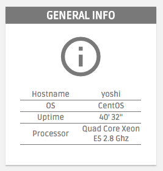
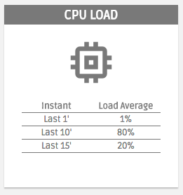
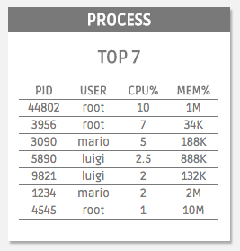
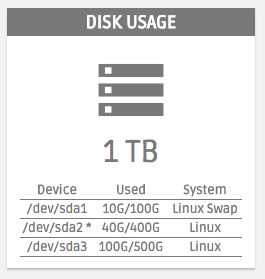
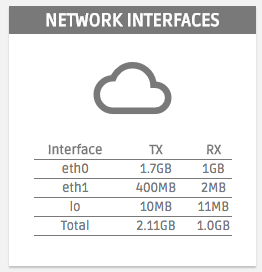

# Prova DW - HTML & CSS

### OBSERVAÇÕES

Leia as observações a seguir:

* A avaliação será realizada no computador, porém individualmente e em silêncio. Não deve haver nenhum tipo de comunicação entre os alunos;
* Cada questão é expresso através deste formato **QUESTÃO N (O DD%)**, no qual o `N`é o número da questão, o `O` significa que o aluno sentado na cadeira ímpar irá fazer essa questão, e `DD%` informa o critério de pontuação, contudo, a desorganização pode penalizar a pontuação final;
* No arquivo de resposta inclua um bloco de comentário no início de seu conteúdo com o nome e a matrícula do aluno;
* Ao concluir as questões chame o professor para avaliar a prova;
* Depois da avaliação envie os arquivos num diretório compactado, seguindo o formato de nome **ALUNO-MATRICULA** para o email **lucachaves+avaliacoesdw20162@gmail.com** com:

> **Assunto:** [IFPB] Prova I DW

> **Conteúdo:** Os arquivos da prova do aluno < nome do aluno > (< matrícula >) estão em anexo.

### DESCRIÇÃO DA PROVA

As questões da prova serão relacionadas ao layout da página Web da Figura 1, no qual os recursos necessários para a página serão disponibilizados através deste [link](https://github.com/ifpb/dw/blob/master/assessment/prova-html-css/code.tar.gz).

*Figura 1 - Layout da página*

Resumidamente o layout é dividido em duas áreas principais, o cabeçalho e a área principal de conteúdo. Cada uma dessas áreas apresentam itens com aparências específicas, que devem ser preservados o mais próximo possível do comportamento  estrutural e do estilo apresentado na Figura 1.

Para facilitar nesse processo, cada questão abordará um item específico, no qual seu conteúdo será previamente disponibilizado por meio dos arquivos baixados. Por exemplo, uma das questões solicitará a criação e estilização dos paineis de informações do Host selecionado, e como ponto de partida, os arquivos baixados já oferecem o conteúdo de cada painel, como exibido a seguir:

> Memory

> material-icons straighten

> 8 GB

> Used	Free

> 20%	80%

para que seja utilizado pelo aluno na criação da estrutura do HTML e estilização do CSS do painel de status da memória.

### QUESTÕES

**QUESTÃO 1 (O,E 33%) -** No Layout da Figura 1 é possível identificar que existe um formulário utilizado para realizar a consulta do Host a ser monitorado. Através dos arquivos obtidos, veja que o layout não apresenta nem HTML e nem CSS do formulário. Então, crie a aparência do formulário conforme a Figura 2 considerando que:

  * O formulário fique centralizado em relação aos paineis;
  * A cor do texto, no campo de texto, é #797979;
  * A cor do plano de fundo do botão de consulta é #797979 e a cor do texto é #fff;
  * Os distanciamentos e aparência entre os elementos sejam preservados.

*Figura 2 - Formulário de consulta de Host.*

**QUESTÃO 2 (66%) -** Outra área importante do layout da Figura 1 são os paineis de informações do Host selecionado, apresentado através dos recortes das Figura 3 até a Figura 8. Todos os textos necessários para essa ilustração estão disponibilizadas, contudo, em todos os paineis é possível identificar que:

  * O cabeçalho do painel possui a cor do plano de fundo com #797979 e o cor do texto com #fff, já em relação ao alinhamento do texto ele é centralizado;
  * Todos os ícones são utilizados através do pacote [Material Icons](https://material.io/icons/);
  * As tabelas possuem a linha inferior com bordar colorida por #797979;
  * Os distanciamentos e aparência entre os elementos são preservados.

Então, através dessas informações construa o:

  **a. (O 33%)** Painel de informações dos hosts conforme a Figura 3.

  **b. (E 33%)** Painel sobre a Carga da CPU conforme a Figura 4.

  **c. (O 33%)** Painel sobre a Carga da Memória conforme a Figura 5.

  **d. (E 33%)** Painel sobre os Processos TOP 7 conforme a Figura 6.

  **e. (O 33%)** Painel sobre o Uso do Disco conforme a Figura 7.

  **f. (E 33%)** Painel sobre o Uso da Rede conforme a Figura 8.

*Figura 3 - Painel de informações dos hosts.*

*Figura 4 - Painel sobre a Carga da CPU.*

*Figura 5 - Painel sobre a Carga da Memória.*

*Figura 6 - Painel sobre os Processos TOP 7.*

*Figura 7 - Painel sobre o Uso do Disco.*

*Figura 8 - Painel sobre o Uso da Rede.*

